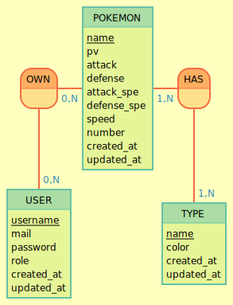

# Model conceptuel des données



````
TYPE: name, color, created_at, updated_at
:
USER: username, mail, password, role, created_at, updated_at

HAS, 1N POKEMON, 1N TYPE
POKEMON: name, pv, attack, defense, attack_spe, defense_spe, speed, number, created_at, updated_at
OWN, 1N POKEMON, 1N USER
```